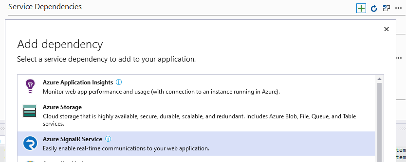

# Publish an ASP.NET Core SignalR app to Azure App Service

By [Brady Gaster](https://twitter.com/bradygaster)

[Azure App Service](/azure/app-service/app-service-web-overview) is a [Microsoft cloud computing](https://azure.microsoft.com/) platform service for hosting web apps, including ASP.NET Core.

> [!NOTE]
> This article refers to publishing an ASP.NET Core SignalR app from Visual Studio. For more information, see [SignalR service for Azure](https://azure.microsoft.com/services/signalr-service).

## Publish the app

This article covers publishing using the tools in Visual Studio. Visual Studio Code users can use [Azure CLI](/cli/azure) commands to publish apps to Azure. For more information, see [Publish an ASP.NET Core app to Azure with command line tools](/azure/app-service/app-service-web-get-started-dotnet).

1. Right-click on the project in **Solution Explorer** and select **Publish**.

1. Confirm that **App Service** and **Create new** are selected in the **Pick a publish target** dialog.

1. Select **Create Profile** from the **Publish** button drop down.

   Enter the information described in the following table in the **Create App Service** dialog and select **Create**.

   | Item               | Description |
   | ------------------ | ----------- |
   | **Name**           | Unique name of the app. |
   | **Subscription**   | Azure subscription that the app uses. |
   | **Resource Group** | Group of related resources to which the app belongs. |
   | **Hosting Plan**   | Pricing plan for the web app. |

1. Select the **Azure SignalR Service** in the **Service Dependencies** > **+** drop-down list:

   

1. In the **Azure SignalR Service** dialog, select **Create a new Azure SignalR Service instance**.

1. Provide a **Name**, **Resource Group**, and **Location**. Return to the **Azure SignalR Service** dialog and select **Add**.

Visual Studio completes the following tasks:

* Creates a Publish Profile containing publish settings.
* Creates an *Azure Web App* with the provided details.
* Publishes the app.
* Launches a browser, which loads the web app.

The format of the app's URL is `{APP SERVICE NAME}.azurewebsites.net`. For example, an app named `SignalRChatApp` has a URL of `https://signalrchatapp.azurewebsites.net`.

If an HTTP *502.2 - Bad Gateway* error occurs when deploying an app that targets a preview .NET Core release, see [Deploy ASP.NET Core preview release to Azure App Service](xref:host-and-deploy/azure-apps/index#deploy-aspnet-core-preview-release-to-azure-app-service) to resolve it.

## Configure the app in Azure App Service

> [!NOTE]
> *This section only applies to apps not using the Azure SignalR Service.*
>
> If the app uses the Azure SignalR Service, the App Service doesn't require the configuration of Application Request Routing (ARR) Affinity and Web Sockets described in this section. Clients connect their Web Sockets to the Azure SignalR Service, not directly to the app.

For apps hosted without the Azure SignalR Service, enable:

* [ARR Affinity](https://azure.github.io/AppService/2016/05/16/Disable-Session-affinity-cookie-(ARR-cookie)-for-Azure-web-apps.html) to route requests from a user back to the same App Service instance. The default setting is **On**.
* [Web Sockets](xref:fundamentals/websockets) to allow the Web Sockets transport to function. The default setting is **Off**.

1. In the Azure portal, navigate to the web app in **App Services**.
1. Open **Configuration** > **General settings**.
1. Set **Web sockets** to **On**.
1. Verify that **ARR affinity** is set to **On**.

## App Service Plan limits

Web Sockets and other transports are limited based on the App Service Plan selected. For more information, see the *Azure Cloud Services limits* and *App Service limits* sections of the [Azure subscription and service limits, quotas, and constraints](/azure/azure-subscription-service-limits#app-service-limits) article.

## Additional resources

* [What is Azure SignalR Service?](/azure/azure-signalr/signalr-overview)
* <xref:signalr/introduction>
* <xref:host-and-deploy/index>
* <xref:tutorials/publish-to-azure-webapp-using-vs>
* [Publish an ASP.NET Core app to Azure with command line tools](/azure/app-service/app-service-web-get-started-dotnet)
* [Host and deploy ASP.NET Core Preview apps on Azure](xref:host-and-deploy/azure-apps/index#deploy-aspnet-core-preview-release-to-azure-app-service)
